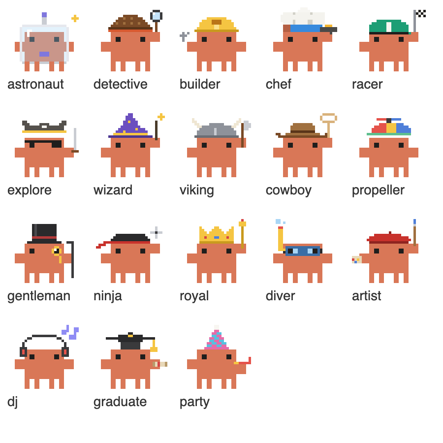

# Control Tower

A Claude Code mod: one pane with a live agent dashboard on top and a list of your subagents below, each drawn as a pixel crab in its own costume.

It merges two MIT-licensed mods:

- [Flightdeck](https://github.com/scasella/claude-flightdeck) by Stephen Casella: main model, context, cost and rate limits, the advisor ("architect") timeline, the permission gate, the turn receipt and the session log.
- [savvy-progress](https://github.com/johnnyvizz/claude-kit/tree/main/plugins/savvy-progress) by johnnyvizz: the subagent list (model, context, tokens, cost, time), the progress band above the prompt, and the `progress` / `step` tools.



## Install

```
/plugin install control-tower --marketplace nicandcranny/claude-code-mods
```

## Use

| Command | Does |
| --- | --- |
| `/control-tower` | open the pane |
| `/control-tower close` | close it |
| `/control-tower reset` | clear agents, checks, consults, log and the turn |
| `/control-tower layout auto\|compact\|wide\|mini` | override the layout for this session |

Focus the pane with `ctrl+x tab`; `f` `s` `o` open the gate's file / shell / other drill-down.

## What you see

- **Docked** (fullscreen terminal, desktop app): the dashboard panels, then the subagent list in an orange box. Agents get costumes in order (astronaut, detective, builder, chef, racer, pirate, wizard, viking, cowboy, propeller, gentleman, ninja, royal, diver, artist, dj, graduate, party), so none repeats until all 18 are out. Props animate while an agent runs.
- **Inline** (terminal main screen): the dashboard's 8-row summary, with up to 3 agents.
- **Above the prompt**: a progress bar while a flow reports through the `mcp__control-tower__progress` tool.

Agent costs are estimates from token counts and a built-in price table, marked `≈`.

## Configure

In `/config`, or under `pluginConfigs["control-tower"].options` in `settings.json`: `architectPattern`, `architectLabel`, `gateLabel`, `panels`, `motion`, `moments`, `matchDescriptions`, `maxCards`, `layout`, `palette` (`theme` or `pastel`), `openOnStart`, `statusLine`, `language` (`auto`, `en`, `ru`).

## Develop

```
claude plugin validate .
claude plugin test .
```

## License

MIT. See [LICENSE](../LICENSE); the original notices are kept in [LICENSE.flightdeck.txt](LICENSE.flightdeck.txt) and [LICENSE.savvy-progress.txt](LICENSE.savvy-progress.txt).
